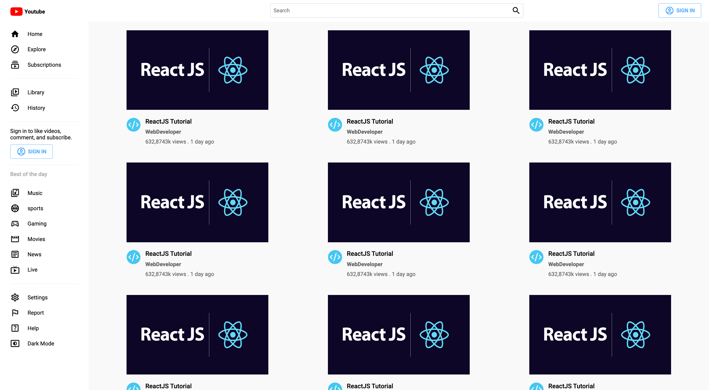
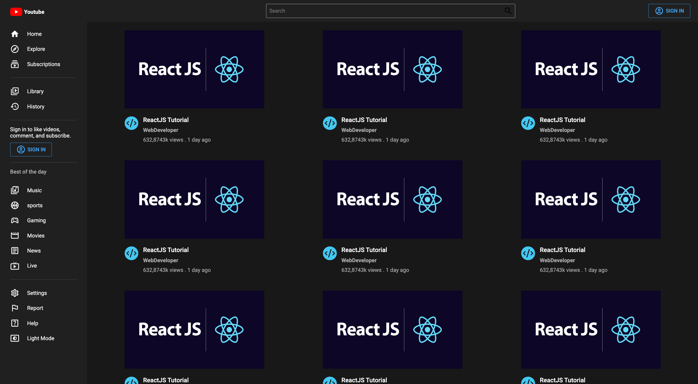
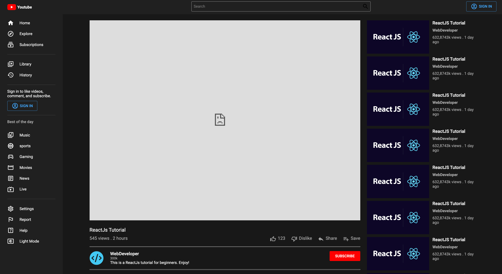
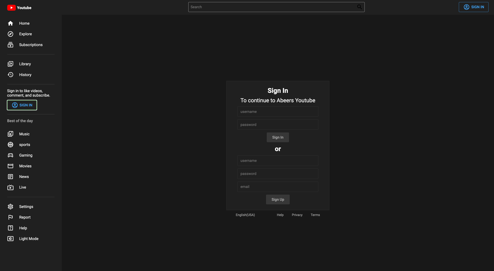

# Youtube
Link to project deployed with netlify. Live demo [here](https://abeers-youtube.netlify.app/)

## Table of Content
* General Information
* Technologies Used
* Features
* Screenshot
* Installation and Setup Instructions
* Usage
* Project Status
* Room for Improvement
* Acknowledgements
* Contact

## General Information
I created this website as a Youtube replica which is a video sharing platform.

### Purpose of this project
To practice web design and routing.

## Technologies Used
* ReactJS
* HTML
* CSS
* JavaScript
* Material UI

## Features
* A Home page.
* A video page that has comments and recommendations.
* A sign in page.
* A dynamic logo and sign in button.
* A dynamic dark/light mode button.
* Used react-routing.

## Screenshot
Home Page - Light Mode

Home Page - Dark Mode

Video Page - Dark Mode

Sign In Page - Dark Mode

## Installation and Setup Instructions

Clone down this repository. You will need node and `npm` installed globally on your machine.

### Installation:

`npm install`

To Run Test Suite:

`npm test`

To Start Server:

`npm start`

To Visit App:

`localhost:3000/`

## Usage

**Dynamic Sign In Button**

* The sign in button will direct you to an authentication page.

**Dark/Light Mode**

* The dark/light mode button will toggle between the two theme options.

**Dynamic Video Cards**

* The video cards will direct you to the video, comments, and recommendations page.

**Dynamic Logo**

* The logo button will redirect you to the home page

## Project Status
Project is: Completed

## Room for Improvement
* Use local storage to save the users theme preferences, this will help avoid the redirection to home page when the Dark/Light button is clicked.

## Acknowledgements
* Many thanks to LamaDev.

## Contact
Created by Abeer Ahmed [LinkedIn profile](add url) - feel free to contact me.

